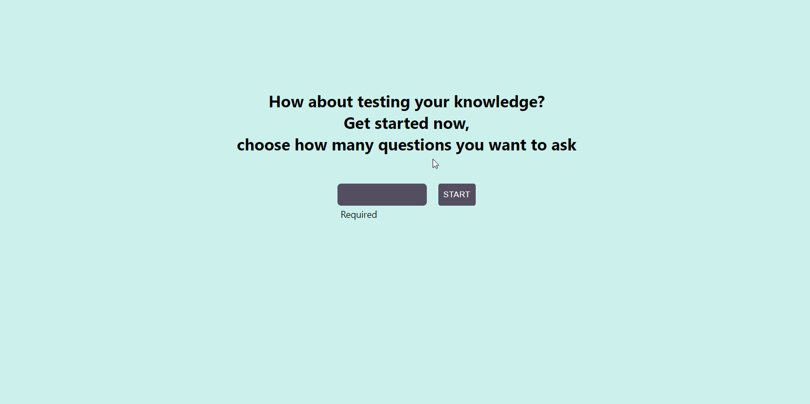

<h1 align="center">
  Quiz
</h1>

  
     

<h1 align="center">
    
</h1>

 

## 🧪 Tecnologias

Esse projeto foi desenvolvido com as seguintes tecnologias:

- [React](https://reactjs.org)
- [TypeScript](https://www.typescriptlang.org/)
- [Formik](https://formik.org)
- [Axios](https://axios-http.com)
- [Material-UI](https://mui.com)

## 💻 Projeto

Projeto simples com react e consumo de api. A aplicação é uma página de quiz, que o usuário escolhe quantas perguntas deseja responder, responde, verifica o resultado e decide se salva ou não elas para ver outra hora.

Acesse o site aqui: <a target="_blank" href="https://quiz-9wv8xt827-thyagoaraujom.vercel.app">Quiz</a>

<h2 id="--Contributing"> 🤝 Contribuindo </h2>

Este projeto é para fins de estudo, então me envie um e-mail me contando o que você está fazendo e por que está fazendo, me ensine o que você sabe.

Todos os tipos de contribuições são muito bem-vindos e apreciados!

⭐️ Iniciar o projeto
 
🐛 Encontrar e relatar problemas
 
📥 Envie PRs para ajudar a resolver problemas ou adicionar recursos

---

<h2 id="-autor">Autor</h2>

<a href="https://github.com/thyagoaraujom">
 
 

 Thyago Araujo 

</a>

---

Feito com ❤️ por Thyago Araujo 👋🏽 [Entre em contato!](https://www.linkedin.com/in/thyago-araujo-m/)
